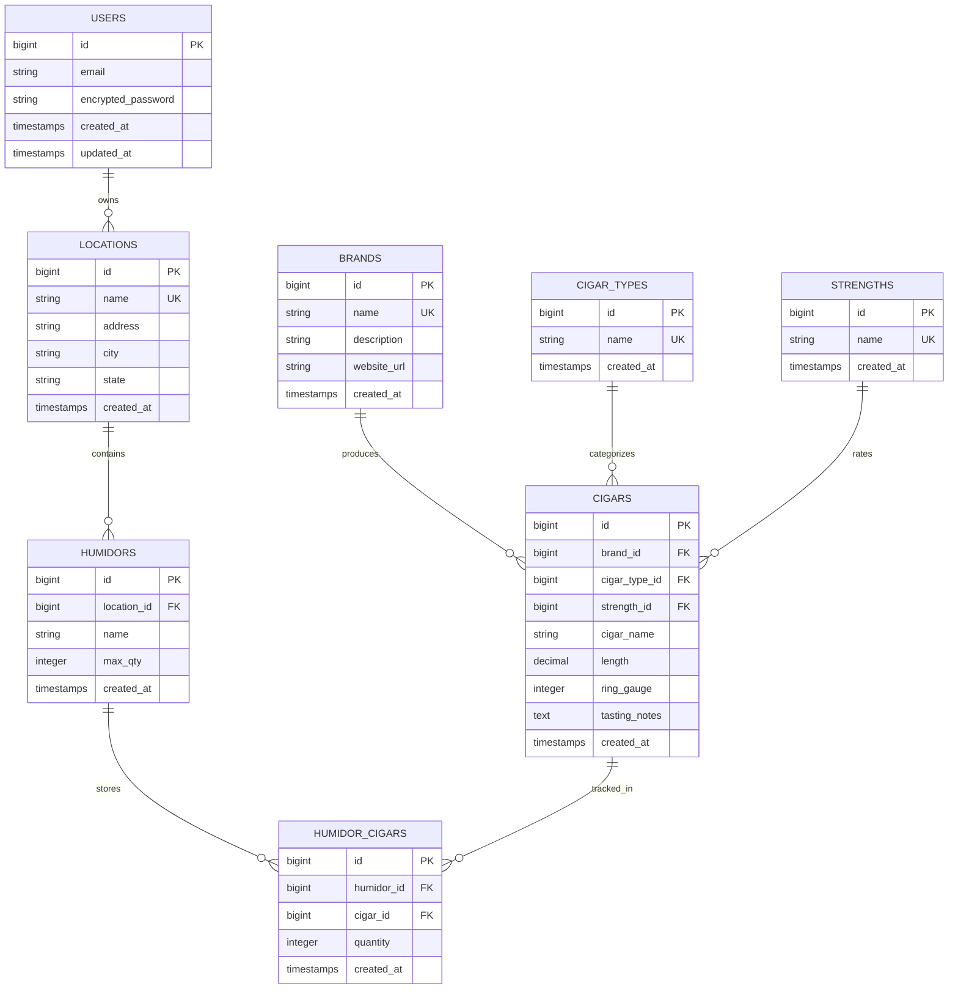

# Cigar Management System - Application Design Document

**Last Updated**: November 1, 2025 2:00 PM EST  
**Version**: 2.0  
**Status**: ✅ **PRODUCTION** - https://cigars.remoteds.us  
**Repository**: [cigar-management-system](https://github.com/worldchanger/cigar-management-system)

---

## 📋 Table of Contents
- [Overview](#overview)
- [Technology Stack](#technology-stack)
- [Data Model](#data-model)
- [Implementation Status](#implementation-status)
- [Features](#features)
- [API Endpoints](#api-endpoints)
- [Deployment](#deployment)
- [Testing](#testing)

---

## 🎯 Overview

The Cigar Management System tracks cigar inventory across multiple humidors with OCR support for cigar band scanning.

### **Core Functionality**
- Multi-humidor inventory management with capacity tracking
- Brand and cigar cataloging with detailed specifications
- OCR-based cigar band recognition (partial implementation)
- Public JSON API for Home Assistant integration
- Real-time dashboard with analytics

### **Production Details**
- **URL**: https://cigars.remoteds.us
- **Port**: 3001
- **Service**: `puma-cigar.service`
- **Database**: `cigar_mangement_sytem_production` (PostgreSQL)

---

## 🛠️ Technology Stack

- **Backend**: Ruby 3.3+ / Rails 7.2.2
- **Database**: PostgreSQL
- **Authentication**: Devise
- **Frontend**: Bootstrap 5, Hotwire (Turbo + Stimulus)
- **OCR**: Tesseract (tesseract-ffi, rmagick)
- **Testing**: RSpec, FactoryBot, Capybara

---

## 🗄️ Data Model

### **Entity Relationship Diagram**



### **Models**

| Model | Repository Link | Description | Associations |
|-------|----------------|-------------|--------------|
| **User** | [app/models/user.rb](https://github.com/worldchanger/cigar-management-system/blob/main/app/models/user.rb) | Authentication via Devise | N/A |
| **Location** | [app/models/location.rb](https://github.com/worldchanger/cigar-management-system/blob/main/app/models/location.rb) | Physical storage locations | has_many :humidors |
| **Humidor** | [app/models/humidor.rb](https://github.com/worldchanger/cigar-management-system/blob/main/app/models/humidor.rb) | Storage containers with capacity | belongs_to :location, has_many :cigars through :humidor_cigars |
| **Brand** | [app/models/brand.rb](https://github.com/worldchanger/cigar-management-system/blob/main/app/models/brand.rb) | Cigar manufacturers | has_many :cigars |
| **Cigar** | [app/models/cigar.rb](https://github.com/worldchanger/cigar-management-system/blob/main/app/models/cigar.rb) | Cigar specifications | belongs_to :brand, has_many :humidors through :humidor_cigars |
| **HumidorCigar** | [app/models/humidor_cigar.rb](https://github.com/worldchanger/cigar-management-system/blob/main/app/models/humidor_cigar.rb) | Join table with quantity | belongs_to :humidor, belongs_to :cigar |
| **CigarType** | [app/models/cigar_type.rb](https://github.com/worldchanger/cigar-management-system/blob/main/app/models/cigar_type.rb) | Cigar categories (e.g., Toro, Robusto) | has_many :cigars |
| **Strength** | [app/models/strength.rb](https://github.com/worldchanger/cigar-management-system/blob/main/app/models/strength.rb) | Cigar strength ratings | has_many :cigars |

---

## ✅ Implementation Status

### **Core Features**

- [x] **User Authentication** - Devise integration complete
- [x] **Location Management** - Full CRUD with views
- [x] **Humidor Management** - Full CRUD with capacity calculations
- [x] **Brand Management** - Full CRUD with cigar associations
- [x] **Cigar Management** - Full CRUD with specifications
- [x] **Inventory Tracking** - HumidorCigar join model with quantity
- [x] **Cigar Types** - Full CRUD for categorization
- [x] **Strength Ratings** - Full CRUD for strength levels
- [x] **Dashboard** - Analytics with charts (Chart.js)
- [x] **Public JSON API** - Home Assistant integration endpoint
- [ ] **OCR Scanning** - ⚠️ **PARTIAL** - Code deployed but not fully functional
- [x] **Image Upload** - ActiveStorage for cigar images
- [x] **Deletion Validation** - Fixed: Cigars require zero inventory to delete

### **Views & UI**

- [x] **Dashboard** - `/dashboard` route with comprehensive analytics
- [x] **Locations** - Index, show, new, edit views
- [x] **Humidors** - Index, show, new, edit views with capacity indicators
- [x] **Brands** - Index, show, new, edit views
- [x] **Cigars** - Index, show, new, edit views with image display
- [x] **Cigar Types** - Index, show, new, edit views
- [x] **Strengths** - Index, show, new, edit views
- [x] **Responsive Design** - Bootstrap 5 with mobile support
- [ ] **OCR Interface** - ⚠️ **PARTIAL** - Views exist but OCR processing incomplete

### **API**

- [x] **GET /api/inventory/:token** - JSON endpoint for external integrations
- [x] **Authentication** - Token-based for API access
- [x] **CORS Configuration** - Configured for Home Assistant

### **Testing**

- [ ] **Model Tests** - Need to be created
- [ ] **Controller Tests** - Need to be created
- [ ] **Feature Tests** - Need to be created
- [ ] **API Tests** - Need to be created

### **Deployment**

- [x] **Production Server** - Deployed at cigars.remoteds.us
- [x] **Systemd Service** - puma-cigar.service configured
- [x] **Nginx Reverse Proxy** - Port 3001 → 443
- [x] **SSL Certificate** - Let's Encrypt configured
- [x] **Database** - PostgreSQL production database
- [x] **Asset Compilation** - cssbundling-rails configured
- [x] **Health Check Endpoint** - /up for monitoring

---

## 🎨 Features

### **Dashboard Analytics**
- Total locations, humidors, brands, and cigar types
- Total inventory count across all humidors
- Capacity status alerts (full/empty humidors)
- Top brands by inventory
- Chart visualizations:
  - Inventory by strength (pie chart)
  - Inventory by brand (pie chart, top 10)
  - Inventory by cigar type (pie chart)
  - Inventory by location (pie chart)
- Recent humidors and cigars

### **Capacity Management**
- Real-time capacity calculations per humidor
- Percentage-based capacity tracking
- Visual indicators for capacity status
- Alerts for near-full humidors (≥95%)

### **Inventory Operations**
- Add cigars to humidors
- Remove cigars from humidors
- Transfer cigars between humidors
- Automatic cleanup of zero-quantity records

### **OCR Integration** ⚠️ **PARTIAL IMPLEMENTATION**
- Cigar band image upload
- OCR text extraction (Tesseract)
- Fuzzy matching for brand/cigar recognition
- **Status**: Code exists but recognition not working reliably

---

## 🔌 API Endpoints

### **Public API**

**GET `/api/inventory/:token`**
- Returns JSON inventory grouped by humidor
- Requires valid token from environment variable
- Used by Home Assistant for display integration

**Response Format**:
```json
{
  "cigars": {
    "HumidorName": [
      {
        "cigar_name": "Undercrown",
        "brand": "Drew Estate",
        "qty": 6,
        "strength": "Medium",
        "type": "Toro"
      }
    ]
  }
}
```

---

## 🚀 Deployment

### **Production Environment**
```bash
# First-time deployment
cd /var/www/cigar
git clone git@github.com:worldchanger/cigar-management-system.git .
bundle install
RAILS_ENV=production rails assets:precompile
RAILS_ENV=production rails db:migrate
sudo systemctl start puma-cigar
sudo systemctl enable puma-cigar
```

### **Redeployment**
```bash
cd /var/www/cigar
git pull origin main
bundle install
RAILS_ENV=production rails assets:precompile
RAILS_ENV=production rails db:migrate
sudo systemctl restart puma-cigar
```

### **Health Check**
```bash
curl https://cigars.remoteds.us/up
```

---

## 🧪 Testing

### **Test Suite**
- **Framework**: RSpec
- **Location**: `spec/` directory
- **Run Command**: `bundle exec rspec`

### **Current Status**
Test files exist but most are empty. Comprehensive test coverage needed for:
- All models (validations, associations, methods)
- All controllers (CRUD operations, authentication)
- Feature tests (user workflows)
- API endpoint tests

**See**: [Testing Strategy Document](../testing-strategies/cigar-testing-strategy.md)

---

## 📚 Related Documentation

- [Deployment Guide](../deployment-guides/CIGAR_DEPLOYMENT_GUIDE.md)
- [Testing Strategy](../testing-strategies/cigar-testing-strategy.md)
- [Architecture Overview](../architecture-security/ARCHITECTURE_SUMMARY.md)

---

**Maintenance Note**: This document should be updated whenever models, controllers, or major features are added/modified. All changes should be documented with implementation status checkboxes.
