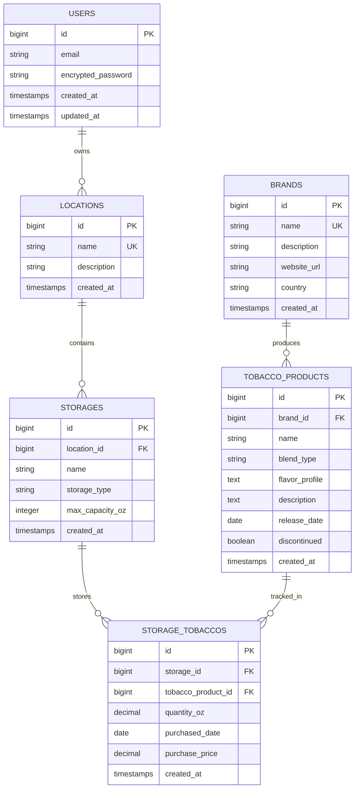

# Tobacco Management System - Application Design Document

**Last Updated**: November 1, 2025 2:15 PM EST  
**Version**: 2.0  
**Status**: ✅ **PRODUCTION** - https://tobacco.remoteds.us  
**Repository**: [tobacco-management-system](https://github.com/worldchanger/tobacco-management-system)

---

## 📋 Table of Contents
- [Overview](#overview)
- [Technology Stack](#technology-stack)
- [Data Model](#data-model)
- [Implementation Status](#implementation-status)
- [Features](#features)
- [API Endpoints](#api-endpoints)
- [Deployment](#deployment)
- [Testing](#testing)

---

## 🎯 Overview

The Tobacco Management System tracks pipe tobacco inventory across multiple storage containers with support for blends and aging profiles.

### **Core Functionality**
- Multi-storage inventory management with capacity tracking
- Brand and tobacco blend cataloging
- Aging profile tracking for cellared tobaccos
- Public JSON API for Home Assistant integration
- Dashboard with analytics and aging insights

### **Production Details**
- **URL**: https://tobacco.remoteds.us
- **Port**: 3002
- **Service**: `puma-tobacco.service`
- **Database**: `tobacco_management_system_production` (PostgreSQL)

---

## 🛠️ Technology Stack

- **Backend**: Ruby 3.3+ / Rails 7.2.2
- **Database**: PostgreSQL
- **Authentication**: Devise
- **Frontend**: Bootstrap 5, Hotwire (Turbo + Stimulus)
- **Testing**: RSpec, FactoryBot, Capybara

---

## 🗄️ Data Model

### **Entity Relationship Diagram**



### **Models**

| Model | Repository Link | Description | Associations |
|-------|----------------|-------------|--------------|
| **User** | [app/models/user.rb](https://github.com/worldchanger/tobacco-management-system/blob/main/app/models/user.rb) | Authentication via Devise | N/A |
| **Location** | [app/models/location.rb](https://github.com/worldchanger/tobacco-management-system/blob/main/app/models/location.rb) | Physical storage locations | has_many :storages |
| **Storage** | [app/models/storage.rb](https://github.com/worldchanger/tobacco-management-system/blob/main/app/models/storage.rb) | Storage containers (jars, tins, etc.) | belongs_to :location, has_many :tobacco_products through :storage_tobaccos |
| **Brand** | [app/models/brand.rb](https://github.com/worldchanger/tobacco-management-system/blob/main/app/models/brand.rb) | Tobacco manufacturers | has_many :tobacco_products |
| **TobaccoProduct** | [app/models/tobacco_product.rb](https://github.com/worldchanger/tobacco-management-system/blob/main/app/models/tobacco_product.rb) | Tobacco blend specifications | belongs_to :brand, has_many :storages through :storage_tobaccos |
| **StorageTobacco** | [app/models/storage_tobacco.rb](https://github.com/worldchanger/tobacco-management-system/blob/main/app/models/storage_tobacco.rb) | Join table with quantity | belongs_to :storage, belongs_to :tobacco_product |

---

## ✅ Implementation Status

### **Core Features**

- [x] **User Authentication** - Devise integration complete
- [x] **Location Management** - Full CRUD with views
- [x] **Storage Management** - Full CRUD with capacity calculations
- [x] **Brand Management** - Full CRUD with tobacco associations
- [x] **Tobacco Product Management** - Full CRUD with blend details
- [x] **Inventory Tracking** - StorageTobacco join model with quantity (oz)
- [x] **Dashboard** - Analytics with charts (Chart.js)
- [x] **Public JSON API** - Home Assistant integration endpoint
- [x] **Image Upload** - ActiveStorage for tobacco/tin images
- [x] **Aging Tracking** - Purchase date tracking for cellaring

### **Views & UI**

- [x] **Dashboard** - `/dashboard` route with analytics
- [x] **Locations** - Index, show, new, edit views
- [x] **Storages** - Index, show, new, edit views with capacity indicators
- [x] **Brands** - Index, show, new, edit views
- [x] **Tobacco Products** - Index, show, new, edit views with blend info
- [x] **Responsive Design** - Bootstrap 5 with mobile support

### **API**

- [x] **GET /api/inventory/:token** - JSON endpoint for external integrations
- [x] **Authentication** - Token-based for API access

### **Testing**

- [ ] **Model Tests** - Need to be created
- [ ] **Controller Tests** - Need to be created
- [ ] **Feature Tests** - Need to be created
- [ ] **API Tests** - Need to be created

### **Deployment**

- [x] **Production Server** - Deployed at tobacco.remoteds.us
- [x] **Systemd Service** - puma-tobacco.service configured
- [x] **Nginx Reverse Proxy** - Port 3002 → 443
- [x] **SSL Certificate** - Let's Encrypt configured
- [x] **Database** - PostgreSQL production database
- [x] **Health Check Endpoint** - /up for monitoring

---

## 🎨 Features

### **Dashboard Analytics**
- Total locations, storages, brands, and tobacco products
- Total inventory (ounces) across all storage
- Capacity status alerts
- Top brands by inventory weight
- Chart visualizations for distribution by brand, type, location
- Recent additions and low stock alerts

### **Capacity Management**
- Weight-based capacity tracking (ounces)
- Percentage-based capacity calculations
- Visual indicators for storage status

### **Aging Insights**
- Purchase date tracking for cellaring
- Age calculation for stored tobaccos
- Discontinued product flagging

---

## 🔌 API Endpoints

### **Public API**

**GET `/api/inventory/:token`**
- Returns JSON inventory grouped by storage
- Requires valid token from environment variable
- Used by Home Assistant

**Response Format**:
```json
{
  "tobaccos": {
    "StorageName": [
      {
        "name": "Peterson Irish Oak",
        "brand": "Peterson",
        "quantity_oz": 8.5,
        "blend_type": "English",
        "age_days": 365
      }
    ]
  }
}
```

---

## 🚀 Deployment

### **Production Commands**
```bash
# First-time deployment
cd /var/www/tobacco
git clone git@github.com:worldchanger/tobacco-management-system.git .
bundle install
RAILS_ENV=production rails assets:precompile
RAILS_ENV=production rails db:migrate
sudo systemctl start puma-tobacco
sudo systemctl enable puma-tobacco
```

### **Redeployment**
```bash
cd /var/www/tobacco
git pull origin main
bundle install
RAILS_ENV=production rails assets:precompile
RAILS_ENV=production rails db:migrate
sudo systemctl restart puma-tobacco
```

### **Health Check**
```bash
curl https://tobacco.remoteds.us/up
```

---

## 🧪 Testing

### **Test Suite**
- **Framework**: RSpec
- **Location**: `spec/` directory
- **Run Command**: `bundle exec rspec`

**See**: [Testing Strategy Document](../testing-strategies/tobacco-testing-strategy.md)

---

## 📚 Related Documentation

- [Deployment Guide](../deployment-guides/TOBACCO_DEPLOYMENT_GUIDE.md)
- [Testing Strategy](../testing-strategies/tobacco-testing-strategy.md)
- [Architecture Overview](../architecture-security/ARCHITECTURE_SUMMARY.md)

---

**Maintenance Note**: Update this document when models, controllers, or features change. Document all changes with implementation status checkboxes.
