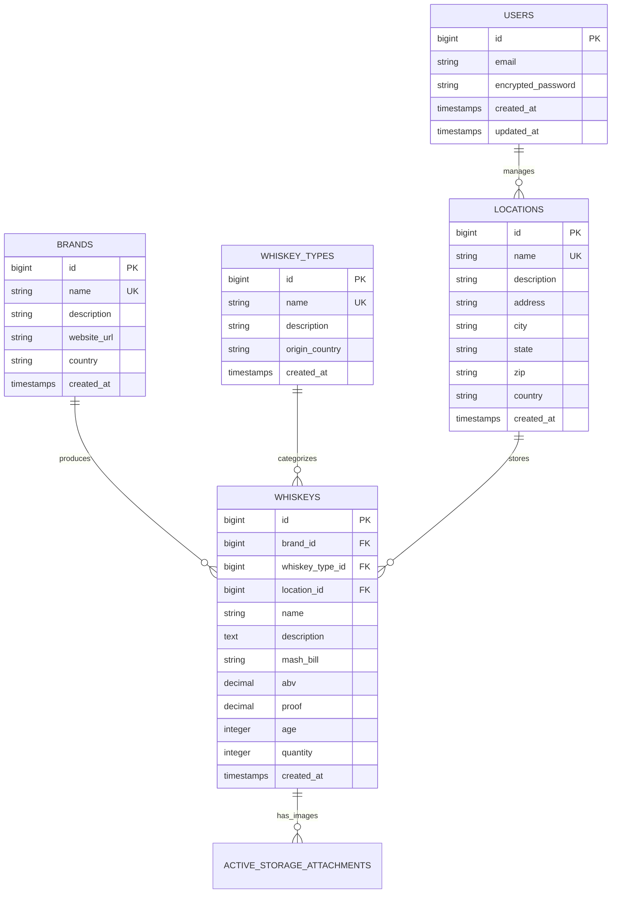

# Whiskey Management System - Application Design Document

**Last Updated**: November 1, 2025 2:20 PM EST  
**Version**: 2.0  
**Status**: ✅ **PRODUCTION** - https://whiskey.remoteds.us  
**Repository**: [whiskey-management-system](https://github.com/worldchanger/whiskey-management-system)

---

## 📋 Table of Contents
- [Overview](#overview)
- [Technology Stack](#technology-stack)
- [Data Model](#data-model)
- [Implementation Status](#implementation-status)
- [Features](#features)
- [Deployment](#deployment)
- [Testing](#testing)

---

## 🎯 Overview

The Whiskey Management System tracks whiskey bottle inventory across multiple locations with detailed specifications for each bottle.

### **Core Functionality**
- Multi-location bottle inventory management
- Brand and whiskey type cataloging
- Detailed specifications (ABV, proof, age, mash bill)
- Dashboard with comprehensive analytics
- Image management for bottle photos

### **Production Details**
- **URL**: https://whiskey.remoteds.us
- **Port**: 3003
- **Service**: `puma-whiskey.service`
- **Database**: `whiskey_management_system_production` (PostgreSQL)

---

## 🛠️ Technology Stack

- **Backend**: Ruby 3.3+ / Rails 7.2.2
- **Database**: PostgreSQL
- **Authentication**: Devise
- **Frontend**: Bootstrap 5, Hotwire (Turbo + Stimulus)
- **Testing**: RSpec, FactoryBot, Capybara

---

## 🗄️ Data Model

### **Entity Relationship Diagram**



### **Models**

| Model | Repository Link | Description | Associations |
|-------|----------------|-------------|--------------|
| **User** | [app/models/user.rb](https://github.com/worldchanger/whiskey-management-system/blob/main/app/models/user.rb) | Authentication via Devise | N/A |
| **Location** | [app/models/location.rb](https://github.com/worldchanger/whiskey-management-system/blob/main/app/models/location.rb) | Physical storage locations | has_many :whiskeys |
| **Brand** | [app/models/brand.rb](https://github.com/worldchanger/whiskey-management-system/blob/main/app/models/brand.rb) | Whiskey distilleries/producers | has_many :whiskeys |
| **WhiskeyType** | [app/models/whiskey_type.rb](https://github.com/worldchanger/whiskey-management-system/blob/main/app/models/whiskey_type.rb) | Whiskey categories (Bourbon, Scotch, etc.) | has_many :whiskeys |
| **Whiskey** | [app/models/whiskey.rb](https://github.com/worldchanger/whiskey-management-system/blob/main/app/models/whiskey.rb) | Whiskey bottle specifications | belongs_to :brand, :whiskey_type, :location; has_many_attached :images |

---

## ✅ Implementation Status

### **Core Features**

- [x] **User Authentication** - Devise integration complete
- [x] **Location Management** - Full CRUD with address fields
- [x] **Brand Management** - Full CRUD with country/website
- [x] **Whiskey Type Management** - Full CRUD with origin tracking
- [x] **Whiskey Management** - Full CRUD with all specifications
- [x] **Inventory Tracking** - Quantity per bottle in database
- [x] **Dashboard** - Comprehensive analytics with charts
- [x] **Image Upload** - Multiple images per whiskey (ActiveStorage)
- [x] **Low Stock Alerts** - Dashboard warnings for bottles ≤2
- [x] **Out of Stock Tracking** - Separate display for quantity=0

### **Views & UI** (All Recently Fixed)

- [x] **Dashboard** - `/dashboard` route with full analytics
- [x] **Whiskeys** - Complete CRUD: index (table), show (all details), new, edit (full form)
- [x] **Brands** - Complete CRUD: index (table with whiskey count), show (brand whiskeys list), new, edit
- [x] **Locations** - Complete CRUD: index (table with whiskey count), show (location whiskeys list), new, edit
- [x] **Whiskey Types** - Complete CRUD: index (table with whiskey count), show (type whiskeys list), new, edit
- [x] **Responsive Design** - Bootstrap 5 matching cigar/tobacco apps
- [x] **All Forms Working** - Proper params permitted in all controllers

### **Dashboard Features**

- [x] **Summary Cards** - Whiskey types, total bottles, brands, locations
- [x] **Inventory Status** - Low stock alerts, out of stock warnings
- [x] **Top Brands** - By bottle count with badges
- [x] **Charts** - Bottles by type, brand (top 10), location (pie charts)
- [x] **Recent Activity** - Recent additions with status badges
- [x] **Low Stock Section** - Dedicated display for bottles running low

### **Testing**

- [ ] **Model Tests** - Need to be created
- [ ] **Controller Tests** - Need to be created
- [ ] **Feature Tests** - Need to be created

### **Deployment**

- [x] **Production Server** - Deployed at whiskey.remoteds.us
- [x] **Systemd Service** - puma-whiskey.service configured
- [x] **Nginx Reverse Proxy** - Port 3003 → 443
- [x] **SSL Certificate** - Let's Encrypt configured
- [x] **Database** - PostgreSQL production database
- [x] **Health Check Endpoint** - /up for monitoring

---

## 🎨 Features

### **Dashboard Analytics**
- Summary cards for quick metrics
- Inventory status with color-coded alerts:
  - Green: Well stocked
  - Yellow: Low stock (≤2 bottles)
  - Red: Out of stock (0 bottles)
- Top brands by bottle count
- Distribution charts:
  - By whiskey type (pie)
  - By brand top 10 (pie)
  - By location (pie)
- Recent additions list with bottle counts
- Low stock alert section

### **Whiskey Specifications**
- **Basic Info**: Name, brand, type, location
- **Technical**: ABV, proof, age (years)
- **Details**: Mash bill composition, description
- **Inventory**: Current quantity with stock status
- **Images**: Multiple bottle photos

### **Brand Details**
- Country of origin
- Website URL
- Description
- List of all whiskeys from brand

### **Location Details**
- Full address (street, city, state, ZIP)
- Country
- List of all whiskeys at location

### **Whiskey Type Details**
- Origin country
- Type description (characteristics, production methods)
- List of all whiskeys of that type

---

## 🚀 Deployment

### **Production Commands**
```bash
# First-time deployment
cd /var/www/whiskey
git clone git@github.com:worldchanger/whiskey-management-system.git .
bundle install
RAILS_ENV=production rails assets:precompile
RAILS_ENV=production rails db:migrate
sudo systemctl start puma-whiskey
sudo systemctl enable puma-whiskey
```

### **Redeployment**
```bash
cd /var/www/whiskey
git pull origin main
bundle install
RAILS_ENV=production rails assets:precompile
RAILS_ENV=production rails db:migrate
sudo systemctl restart puma-whiskey
```

### **Health Check**
```bash
curl https://whiskey.remoteds.us/up
```

---

## 🧪 Testing

### **Test Suite**
- **Framework**: RSpec
- **Location**: `spec/` directory
- **Run Command**: `bundle exec rspec`

### **Test Coverage Needed**
- Model validations and associations
- Controller CRUD operations
- Dashboard calculations
- Form submissions
- Stock status logic

**See**: [Testing Strategy Document](../testing-strategies/whiskey-testing-strategy.md)

---

## 📚 Related Documentation

- [Testing Strategy](../testing-strategies/whiskey-testing-strategy.md)
- [Architecture Overview](../architecture-security/ARCHITECTURE_SUMMARY.md)

---

## 🔄 Recent Updates (November 1, 2025)

### **Complete UI Overhaul**
- Fixed all whiskey views (show page was blank - now displays all data)
- Created comprehensive forms for whiskeys (all fields working)
- Built full CRUD for brands (index, show with whiskey list, forms)
- Built full CRUD for locations (index, show with whiskey list, forms with address)
- Built full CRUD for whiskey_types (index, show with whiskey list, forms)
- Added /dashboard route
- All controllers now have proper params permitted
- All views styled with Bootstrap 5 matching cigar/tobacco apps

---

**Maintenance Note**: Update this document when models, controllers, or features change. Document all changes with implementation status checkboxes.
